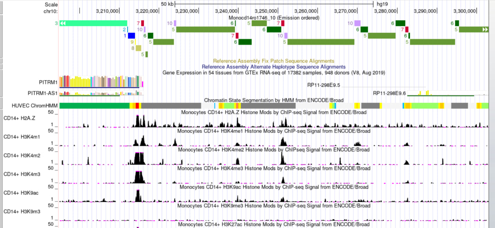

# hse_hw3_chromhmm

### Ссылка на Colab

https://colab.research.google.com/drive/1a2OvUJKgt-t7ycJfwmCP9kCazkoZ92MT?usp=sharing

### Cellmarks

### ChromHMM

### Разметка

|   | Название  | Характерные метки  |
|---|---|---|
| 1  |  Insulator | H2AFZ,H3K27ac, H3K79me2|
|  2 | Txn_Transition | H3K4me2, H3K79me2  |
| 3  | Weak_Enhancer | H3K36me3   |
| 4  |  Weak_TXN  |  H3K4me2 |
| 5  | Transcriptional transition  | -  |
| 6  |  Polycomb-repressed | H2AFZ  |
| 7  |  Weak_Enhancer |  H3K4me2 |
| 8  | Strong enhancer | H2AFZ, H3K4me1, H3K4me2, H3K4me3, H3K9ac, H3K27ac  |
| 9  | Strong_Enhancer  | H2AFZ,H3K4me1  |
| 10  | Transcriptional transition  |  H3K4me1, H3K9ac |
